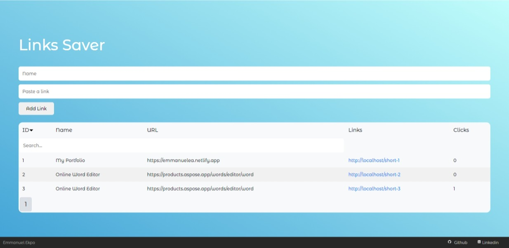

<div align="center" id="top"> 
  

  &#xa0;

  <!-- <a href="https://url_short.netlify.app">Demo</a> -->
</div>

<h1 align="center">URL_SHORT</h1>

<p align="center">
  

  

  
</p>

<!-- Status -->

<!-- <h4 align="center"> 
	🚧  URL_SHORT 🚀 Under construction...  🚧
</h4> 

<hr> -->

<p align="center">
  <a href="#dart-about">About</a> &#xa0; | &#xa0; 
  <a href="#sparkles-features">Features</a> &#xa0; | &#xa0;
  <a href="#rocket-technologies">Technologies</a> &#xa0; | &#xa0;
  <a href="#white_check_mark-requirements">Requirements</a> &#xa0; | &#xa0;
  <a href="#checkered_flag-starting">Starting</a> &#xa0; | &#xa0;
  <a href="#memo-license">License</a> &#xa0; | &#xa0;
  <a href="https://github.com/Ekpo-Emmanuel" target="_blank">Author</a>
</p>

<br>

## :dart: About ##

This is a Link Saver Service like Linktree

## :sparkles: Features ##

:heavy_check_mark: Save Links and names to Database;\
:heavy_check_mark: Edit Links;\
:heavy_check_mark: Share Links;\
:heavy_check_mark: Sort and Filtering;\


## :rocket: Technologies ##

The following tools were used in this project:

- [php](https://expo.io/)
- [MySQL](https://nodejs.org/en/)
- [Javascript](https://pt-br.reactjs.org/)
- [JQuery](https://reactnative.dev/)


## :white_check_mark: Requirements ##

Before starting :checkered_flag:, you need to have [XAMPP](https://www.apachefriends.org/download.html) installed.

## :checkered_flag: Starting ##

```bash
# Clone this project
$ git clone https://github.com/Ekpo-Emmanuel/url_short

# Access
$ cd url_short

# Create datbase name called "short-urls" in 
$ cd configs/

# Run the project
$ http://localhost/URL_SHORT/

```
## :memo: License ##

This project is under license from MIT. For more details, see the [LICENSE.md](LICENSE.md) file.

Made with :heart: by <a href="https://github.com/Ekpo-Emmanuel" target="_blank">Emmanuel Ekpo</a>


<a href="#top">Back to top</a>
